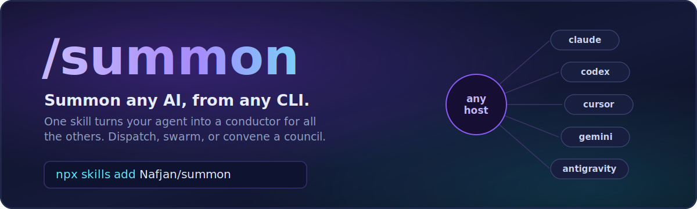

<p align="center">
  
</p>

<h1 align="center">Summon</h1>

<p align="center"><b>Summon any AI, from any CLI.</b> One skill, every model as a sub-agent.</p>

<p align="center">
  <a href="https://github.com/Nafjan/summon/actions/workflows/ci.yml"></a>
  <a href="LICENSE"></a>
  
  
  
  
</p>

<p align="center"><b>Install:</b> <code>npx skills add Nafjan/summon</code>, then just ask your agent.</p>

Summon is a tiny, dependency-free tool that turns one AI agent into a conductor for all of
them. It runs wherever your agent can execute a shell command:

- **Coding CLIs:** Claude Code, Codex, Cursor CLI, Gemini CLI, Antigravity.
- **AI IDEs:** Cursor, Antigravity, or VS Code with an agent extension. The skill installs
  as a slash command, or the agent just shells out to the dispatcher.
- **Desktop agent apps:** the Claude app and the ChatGPT app (formerly Codex), whose agent
  modes can run the dispatcher and read the skill.
- **A plain terminal,** where you drive it yourself.

From any of those you can hand a task to another model, run several at once, or convene a
council to make a decision. It also reaches any OpenAI-compatible API, so OpenRouter,
OpenAI, Anthropic, Google, and local models (Ollama, LM Studio) work as agents too.

```
                          ┌──────────────────────┐
   any host CLI ────────► │       summon         │ ───► claude         (Anthropic)
   (claude, codex,        │  stdlib dispatcher   │ ───► codex          (OpenAI)
   cursor, gemini,        │  one JSON envelope   │ ───► cursor-agent   (Cursor)
   or your terminal)      │  no server, no pip   │ ───► gemini         (Google)
                          └──────────────────────┘ ───► agy            (Antigravity)
                                                   └──► openai-compat   (OpenRouter / OpenAI /
                                                        Anthropic / Google / Ollama / …)
```

Most multi-agent tools assume one specific CLI is the orchestrator. Summon inverts that:
**any CLI can be the boss.** Your Codex session can summon Claude for a review. Your Claude
session can summon Codex for an adversarial pass. Your terminal can summon a whole council
to decide something. Each runs in its own git worktree, in parallel, and every result comes
back as one JSON envelope you can branch on.

---

## Who it's for

- **Developers who live in an AI coding tool** (a CLI, an AI IDE, or a desktop agent app)
  and want the *other* models one command away, without switching tools.
- **Anyone who wants a real second opinion.** Cross-vendor review, where no model grades
  its own homework, is built in rather than bolted on.
- **People making decisions with AI** who want more than one model's take: council mode
  gets you diverse positions, anonymized peer ranking, and a synthesized recommendation.
- **Power users running fleets of agents:** fan a task across N models in parallel, with
  per-backend throttling and resumable batches.
- **Anyone unifying local + cloud models** behind one interface (subscription CLIs *and*
  OpenAI-compatible APIs, including self-hosted).

If you just want a chat UI, this isn't it. Summon is a dispatcher: you or another agent
drive it, and it hands back structured results instead of a stream.

---

## What you can actually do with it

- **Cross-vendor code review:** `summon dispatch --agent adversarial-reviewer` sends your
  diff to a *different* vendor than wrote the code.
- **Race several implementations:** three models each build the same spec in isolated git
  worktrees; you diff the branches and keep the best.
- **Decide by council:** ask "monorepo or polyrepo?" and four diverse models answer, rank
  each other anonymously, and a chairman synthesizes a call with confidence and dissents.
- **Swarm over documents:** a manifest of 40 jobs with per-backend concurrency, resumable
  if it crashes. Good for reviewing, summarizing, or labeling at scale.
- **Structured extraction:** `--json-schema` makes any agent return validated JSON.
- **Use local + frontier models together:** an Ollama model and Claude in the same council.

---

## Install

**One command. The skill installs itself into your agent:**

```bash
npx skills add Nafjan/summon
```

That's the whole thing. Your AI agent now has the `summon` skill and knows how to drive it,
so you never learn a flag. Just ask it: *"summon a cross-vendor review of my last commit,"*
or *"convene a council on monorepo vs polyrepo."* Add `-g` to install globally (every
project), or `-a <agent>` to target a specific one. Works with any skills-compatible agent:
Claude Code, Codex, Cursor, Gemini, Antigravity, and claw-likes like openclaw and hermes.
Powered by the open [`skills`](https://www.skills.sh) registry.

**Or install into every AI CLI on your machine at once** (multi-host, ownership-safe):

```bash
git clone https://github.com/Nafjan/summon && cd summon
python summon.py doctor      # which backends are ready? what's missing?
python install.py            # install the skill into every detected AI CLI
```

`install.py` stages atomically, never touches an agent file you already have, and uninstalls
cleanly (`python install.py --uninstall`). Migrating from the old name? `--with-alias` adds a
thin `/sub-agents` alias.

<details>
<summary><b>Or let your AI agent set it up for you</b> (it adapts to your machine)</summary>

<br>Paste this into your favorite AI CLI (Claude Code, Codex, Cursor, Gemini, …) in a scratch folder:

```text
Set up "summon" for me (github.com/Nafjan/summon), a cross-vendor AI sub-agent dispatcher.

1. Clone https://github.com/Nafjan/summon and cd into it.
2. Run `python summon.py doctor` and tell me which backends are installed and logged in
   (claude, codex, cursor-agent, gemini, agy) and which are missing.
3. Run `python install.py` to install the summon skill into every AI CLI on this machine
   (it auto-detects ~/.claude, ~/.codex, ~/.cursor, ~/.gemini, ~/.copilot and never
   overwrites my own agents). Add `--with-alias` only if I ask for the legacy /sub-agents name.
4. Run `python summon.py doctor` again and confirm what's now ready.
5. Read README.md and SKILL.md, then summarize: what I can do now, and ONE example command
   using a backend I actually have. If a backend I want is missing, tell me exactly how to
   install and log into its CLI.
6. Offer to add the "Delegating to summon" snippet from README.md to my host config
   (CLAUDE.md / AGENTS.md / GEMINI.md / .cursor/rules) so you reach for summon on purpose:
   cross-vendor review before merge, --council for decisions, --manifest for fan-out. Only
   add it if I say yes.
```
</details>

You can also skip the skill install entirely and run the script directly:
`python summon.py dispatch --agent reviewer --prompt "…" --cwd "$PWD"`.

---

## Your first run

```bash
# from any project directory (use an absolute --cwd)
python summon.py dispatch --agent reviewer \
  --prompt "Review the diff on this branch for correctness bugs" --cwd "$PWD"
```

Or, once the skill is installed, just tell your AI CLI:

> "Summon the adversarial reviewer on my last commit and give me the findings."

---

## Command surface

Git-style subcommands. The old flat `--flag` form still works too:

| Command | Does |
|---|---|
| `summon dispatch --agent N --prompt … --cwd D` | run one agent (the default action) |
| `summon list` | list available agents |
| `summon models [--cli B]` | what each backend can run right now |
| `summon doctor [--json]` | backend / setup health check (run this first) |
| `summon manifest FILE` | run a batch swarm (per-backend concurrency, resumable) |
| `summon council --question "…"` | **decide by consensus** of diverse models |
| `summon agent new\|set NAME --set k=v` | scaffold / retune an agent definition |
| `summon version` · `summon help` | version · usage |

`summon` (no args) prints the command list. Everything below is documented in
[skills/summon/SKILL.md](skills/summon/SKILL.md).

---

## How to use it effectively

1. **Pick the right agent, not just the right model.** Agents bundle a model, a persona,
   and a report contract. `reviewer` (Codex) reviews; `planner` (Opus) plans; `pair`
   (Sonnet) does everyday work. `summon list` shows them; `summon agent new` makes your own.
2. **Chain with `handoff`.** Every result includes `report.handoff`. Paste it into the
   next dispatch instead of re-explaining; that's how multi-step work stays cheap.
3. **Trust the envelope, not the prose.** Branch on `status`; a run that ends asking for
   approval or self-reports `BLOCKED` comes back `blocked`, never a false `success`. Check
   `model.resolved` to confirm which model actually served you.
4. **Review across vendors.** Send code written by one vendor to a reviewer on another.
   `docs/PROTOCOL.md` has the rule and the named patterns (debate, async build, competing
   hypotheses, consensus).
5. **Put big inputs in files.** For long prompts, write a packet under `--cwd` and pass a
   short "read X and follow it" prompt (avoids arg-length limits and sandboxed reads).
6. **Fan out with `manifest`; decide with `council`.** Independent tasks → a manifest
   swarm; a judgment call → a council.

Full playbook: **[docs/PROTOCOL.md](docs/PROTOCOL.md)**.

---

## Teach your agent to reach for it (`CLAUDE.md` / `AGENTS.md`)

summon is invoked *by* your coding agent, so it only gets used well if the agent knows
*when* to reach for it. The skill's description triggers it, but a few lines in your host
config make the agent orchestrate on purpose. Drop this into your `CLAUDE.md`, `AGENTS.md`,
`GEMINI.md`, or `.cursor/rules` (whatever your CLI reads):

```md
## Delegating to summon (cross-vendor sub-agents)

When a task is heavy, parallelizable, or would benefit from another vendor's eyes,
dispatch it with the **summon** skill instead of doing everything yourself:

- **Cross-vendor review before merge (house rule).** Never merge a substantive change
  reviewed only by the model that wrote it; it shares that model's blind spots. Route
  claude/cursor-written code to codex (`reviewer` / `adversarial-reviewer`); route
  codex-written code to a claude reviewer (`quick-reviewer`).
- **High-stakes decisions → `--council`.** Convene a vendor-diverse council and let a
  chairman synthesize. Disagreement that survives round 2 is worth taking seriously.
- **Independent work → `--manifest`.** Fan several jobs out with per-backend
  concurrency; each writes its own result envelope you can inspect.
- **Escalate the hardest problems** to the top tier (`fable`, or an opus agent). Keep
  councils and swarms diverse; a council of clones is pointless.

Verify, don't trust: branch on the returned `status`; a `report_ok:false` or
`suspect:true` "success" means re-dispatch. Read `warnings` (model fell back, agy
can't read `--cwd` files, credit spend). `model.resolved` proves what actually ran.
Preview a paid fan-out with `--dry-run`, pass `--json-schema` when you need structured
output, and chain via `report.handoff` into the next call.
```

Tune it to your workflow. The point is that your agent reaches for summon on purpose
(delegate, review across vendors, decide by council) instead of forgetting it exists.
The agent-led installer above can add a snippet like this for you.

### Orchestration practices that hold up

A few habits that keep multi-agent work fast, cheap, and trustworthy:

- **Verify across vendors, not within.** A model reviewing its own output shares its blind
  spots. This is the habit that pays off most, and summon puts the other vendor one command
  away.
- **Adversarial-verify findings before you act on them.** Have a second (ideally different)
  model try to *refute* a claim; a finding that survives is worth trusting. Don't merge on
  one pass.
- **Decide by council, converge by chairman.** For a judgment call, N diverse positions
  plus anonymized peer ranking plus a synthesis beats one model iterated. `--council` does
  exactly that.
- **Keep the orchestrator's context clean.** Delegate the heavy reading and searching to
  sub-agents and keep only their `report.handoff`. That's how long chains stay affordable.
- **Prefer structured output for anything you branch on.** `--json-schema` + `parse_ok`
  removes brittle "find the JSON" heuristics from your side entirely.
- **Isolate parallel edits.** `--worktree` gives each concurrent agent its own branch so a
  fan-out can't collide; you diff and merge the winner.

### Pairs well with your other skills

summon just dispatches. It doesn't try to reimplement the thinking-discipline that
dedicated skills already do well; it composes with whatever your CLI has installed. Some
categories that pair well (use what your ecosystem offers):

- **Adversarial code review:** a skill that forces real perspective shifts pairs well with
  cross-vendor dispatch. summon sends the diff to a *different* vendor; the review skill
  makes that vendor actually critical.
- **Coding discipline:** Karpathy-style guidelines (surface assumptions, keep it simple,
  surgical changes) applied by each sub-agent keep a swarm from over-building.
- **Deep-research harnesses:** fan-out, fetch, and verify for the *findings*, with summon
  running the cross-vendor verification pass.
- **Planning / spec-driven workflows:** a plan or spec skill decomposes the work; summon
  fans the pieces out (`--manifest`) and reviews them across vendors before merge.
- **Project memory / knowledge graph:** a durable-memory skill writes `.agents/memory.md`,
  which summon auto-injects into every sub-agent so they never re-learn your conventions.

Rule of thumb: let specialist skills *think*, and let summon route that thinking across
vendors.

---

## What a dispatch returns

```json
{
  "status": "success",
  "result": "…the agent's full answer…",
  "report": { "status": "DONE", "summary": "Reviewed 4 files; 2 findings",
              "handoff": "Fix the race in poller.py:88 first" },
  "report_ok": true,
  "model":   { "requested": "sonnet", "resolved": "claude-sonnet-5" },
  "permission": "safe-edit", "permission_flags": ["--permission-mode", "acceptEdits"],
  "usage": { "input_tokens": 12038, "output_tokens": 981 }, "cost_usd": 0.084,
  "billing": { "source": "subscription", "note": "Claude login" },
  "elapsed_ms": 7285,
  "resume": { "cli": "claude", "session_id": "0197…" }
}
```

- `report.handoff` → the context to pass to the next call.
- `report_ok: false` on a "success" → also gets `suspect: true`. Agents that skip their
  contract don't get believed.
- `billing.source` → did this draw from a **subscription** or metered **api** credits.
- `resume.session_id` → `--resume` for a cheap follow-up.

> **Costs are estimates.** `cost_usd`/`usage` are the CLI's own list-price figures, not a bill. On a subscription they don't equal money spent, and `billing.source` is a best-effort guess. Know your plan's inclusions and limits, and check your provider's latest billing and model notices directly.

---

## Council mode: decide by consensus

```bash
summon council --question "Adopt a monorepo or keep polyrepos?" \
  --members planner,reviewer,researcher,pair --chairman fable --rounds 2 --cwd "$PWD"
```

A vendor-diverse council answers independently. With `--rounds 2` they see all positions
anonymized, refine, and rank them; votes aggregate (Borda) into `consensus_ranking`, and
the chairman returns a decision, a confidence, the agreements, the named dissents, and a
next action. It's the llm-council pattern, run over *real cross-vendor CLIs* instead of one
API's models.

---

## Custom & local models (`openai-compat`)

```markdown
---
run-agent: openai-compat
provider: openrouter          # or openai / anthropic / google / groq / ollama / lmstudio
model: anthropic/claude-3.5-sonnet
---
```

Built-in providers, plus your own in `providers.json` (or inline `base_url` + `api_key_env`,
empty key for local servers). Same envelope, same `manifest`/`council`. This is how you add
local models and multi-model API access, and how a council becomes a genuine multi-vendor
board. These backends bill your API credits, not a subscription (see [TERMS.md](TERMS.md)).

---

## The starter roster (20 agents, all editable)

Planning/architecture on Claude (`planner`, `architect`, `deep-debugger`,
`security-auditor`, `fable`), implementation + adversarial review on Codex (`implementer`,
`reviewer`, `adversarial-reviewer`, `debugger`, `test-author`), coding on Cursor (`coder`,
`bug-fixer`), research/docs/frontend on Antigravity (`researcher`, `docs-writer`,
`frontend`), and balanced lanes on Sonnet 5 (`pair`, `editor`, `quick-reviewer`, `pr-prep`).
Each is a plain `.md` file: edit, delete, or add your own with `summon agent new`.
`install.py` never overwrites an agent you already have.

---

## How it compares

| | summon | agent-bridge / CCB / claude-codex-collab | cc-fleet | MCO |
|---|---|---|---|---|
| Vendors | **6** (incl. Antigravity headless + any OpenAI-compatible API) | 2–3 | Claude only | 2–3 |
| Any CLI as host | **yes** | mostly Claude-hosted | no | no |
| Structured envelope + lie-detection | **yes** | partial | no | no |
| Consensus / council mode | **yes** (anonymized ranking + chairman) | no | no | no |
| Cost/usage + billing source | **yes** | partial | no | no |
| Worktree + background + manifest fan-out | **yes, from any host** | no | yes (Claude-hosted) | no |
| Runtime footprint | **a folder of stdlib Python** | daemon / MCP / npm tree | plugin | server |

Caveats: those tools have nicer streaming UIs and bigger communities, and summon is a
dispatcher, not a dashboard. Gemini resume isn't supported, because its CLI can't re-target
a headless session.

---

## System requirements

- **Python 3.10+** (3.11+ recommended). Standard library only, so no `pip install` for the
  dispatcher itself. The optional **agy** backend's PTY wrapper wants `pip install pywinpty pyte`.
- **At least one backend:** a vendor CLI installed and logged in (`claude`, `codex`,
  `cursor-agent`, `gemini`, or `agy`), and/or an API key for an `openai-compat` provider (or
  a local Ollama/LM Studio server). `summon doctor` tells you what you have and what's missing.
- **`git`** if you use `--worktree`.
- **A host that can run a shell command:** a coding CLI, an AI IDE, a desktop agent app, or
  a plain terminal. Anything that can invoke `python` and read the skill can drive it.
- **OS:** Windows runs every backend (it's what I use daily). Linux and macOS run all of
  them except agy out of the box. CI covers Ubuntu and Windows.

You bring the model access; summon just orchestrates the CLIs and APIs you already use.

---

## Security, permissions, and terms (please read)

- **Permissions.** Each agent's `permission:` (`read-only` / `safe-edit` / `yolo`) maps to
  that CLI's own sandbox flags. Bundled agents ship `safe-edit` (auto-approve edits, no
  bypass). The exception is agy: it has no workspace-write tier, so its `safe-edit` is a
  full bypass, like `yolo`. Raise anything to `yolo` deliberately, and only in repos you trust.
- **Treat the whole `--cwd` as trusted.** Files under it, `.agents/memory.md`
  (auto-injected into agent context), and manifest `prompt_file`s are trusted operator
  input. Every bundled agent also carries an "untrusted content: data, not instructions"
  guard as defense-in-depth. **Don't run summon in a repository you don't trust.**
- **Secrets.** The agy backend copies OAuth tokens into a per-invocation profile locked to
  your user (icacls / `0700`) and isolated from your real profile. `openai-compat` reads
  API keys from env only and redacts them from any error output.
- **Terms of service.** Summon drives each vendor's *official* CLI (built for scripted use)
  on *your* accounts, which is the intended path for personal and dev work. Don't share
  accounts, build a product on subscription auth, or hammer parallel volume; use API-key
  backends for commercial or high-volume work. Providers can change programmatic-billing
  rules. Full guidance in **[TERMS.md](TERMS.md)**.
- **No phone-home.** For the five CLI backends, summon sends no telemetry and makes no
  network calls of its own; it just spawns the backend CLIs, plus supporting tools where a
  feature needs them (`git`, `icacls`/`chmod`, the agy PTY wrapper, a detached copy of
  itself for `--background`). The one exception is the `openai-compat` backend, whose whole
  job is a direct HTTPS call to the `base_url` you configure.

---

## FAQ

**What happens when a vendor ships a new model?** Nothing breaks. Model strings pass
through verbatim; aliases like `opus` and `sonnet` float, `summon models` shows what's
available, and the envelope's `model.resolved` confirms what ran. Aliases can lag a launch
by a day or two, so pin the explicit ID when you need the newest.

**Does it need API keys?** For the five CLI backends, no. It drives the logins you already
have, and it strips `OPENAI_API_KEY` from codex children so you're not silently billed at
API rates. The `openai-compat` backend uses your API key by design.

**Is it safe to let an agent install it for me?** Yes. The agent-led prompt clones the repo,
runs `doctor` (read-only) and `install.py` (which never overwrites your files), and reports
back. Read `install.py` first if you like; it's about 460 lines of stdlib.

**Why not MCP?** MCP adds a server and a session dependency for what is fundamentally a
one-shot subprocess/HTTP dispatch. A script you can read beats a protocol you must trust.
(An MCP facade may come later; the envelope won't change.)

---

## Contributing

Contributions are welcome. New backends, agents, and providers are the easy wins.
A new backend is one entry in a registry
([skills/summon/references/adding-a-backend.md](skills/summon/references/adding-a-backend.md));
a new agent is a `.md` file. See **[CONTRIBUTING.md](CONTRIBUTING.md)** for dev setup, ground rules (stdlib only,
every change tested, secrets redacted), and the PR checklist. Run
`python skills/summon/scripts/test_discovery.py` and `python tests/test_install.py` before a PR.

## Roadmap

- POSIX PTY wrapper for the agy backend
- Gemini resume when its CLI grows a stable session id
- True argparse subcommands (structural mode-enforcement) once the flat form can be dropped
- Explicit numeric peer-ranking display and an optional MCP facade

## Credits

Sharpened against the ecosystem: agent-bridge, CCB, claude-codex-collab, cc-fleet, MCO,
swarms, Omnigent, and Karpathy's llm-council. I've run summon privately for months,
dispatching real work across many CLIs every day, and sharpened it hard over the last few
weeks. The results have been good enough that it was worth generalizing and hardening into
this public repo.

## License

[MIT](LICENSE). Do what you like, no warranty. See [TERMS.md](TERMS.md) for the
provider-terms caveats, which are on *you*, not on this software.
