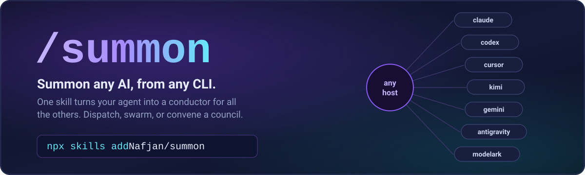

<p align="center">
  
</p>

<h1 align="center">Summon</h1>

<p align="center"><b>Summon any AI, from any CLI.</b> One skill, every model as a sub-agent.</p>

<p align="center">
  <a href="https://github.com/Nafjan/summon/actions/workflows/ci.yml"></a>
  <a href="LICENSE"></a>
  
  
  
  
</p>

<p align="center"><b>Install:</b> <code>npx skills add Nafjan/summon</code>, then ask your agent to use it.</p>

Summon is a dependency-free dispatcher. It routes tasks from one agent CLI to supported CLIs
and configured endpoints wherever the host can execute a shell command:

- **Coding CLIs:** Claude Code, Codex, Cursor CLI, Gemini CLI, Kimi, Antigravity, and ArkCLI.
- **T3 Code:** install Summon into the Claude, Codex, and Cursor skill roots
  T3 discovers (`python install.py --profile t3`). Not a native T3 plugin; see
  [the T3 Code setup guide](skills/summon/references/t3-code.md).
- **AI IDEs:** Cursor, Antigravity, or VS Code with an agent extension. The skill installs
  as a slash command, or the agent invokes the dispatcher.
- **Desktop agent apps:** the Claude app and the ChatGPT app (formerly Codex), whose agent
  modes can run the dispatcher and read the skill.
- **A plain terminal,** where you drive it yourself.

From any of those hosts, you can hand a task to another model, run several at once, convene a
council, or start a governed deliberation. It also reaches any OpenAI-compatible API directly,
or through OpenCode's toolful gateway when the agent needs a file/tool loop. OpenRouter, OpenAI,
Anthropic, Google, and local models (Ollama, LM Studio) work as agents too.

```
                          ┌──────────────────────┐
   any host CLI ────────► │       summon         │ ───► claude         (Anthropic)
   (claude, codex,        │  stdlib dispatcher   │ ───► codex          (OpenAI)
    cursor, gemini, kimi,   │  one JSON envelope   │ ───► cursor-agent   (Cursor)
    opencode, or terminal) │  no server, no pip   │ ───► gemini         (Google)
                          └──────────────────────┘ ───► kimi           (Moonshot AI)
                                                   ├──► agy            (Antigravity)
                                                    ├──► arkcli         (BytePlus Coding Plan)
                                                    ├──► opencode       (OpenCode gateway)
                                                    ├──► zcode          (native ZCode preview)
                                                    └──► openai-compat  (ModelArk / OpenRouter /
                                                         Z.AI Coding Plan / OpenAI / Anthropic / …)
```

Most multi-agent tools assume one specific CLI is the orchestrator. Summon inverts that:
**any CLI can be the boss.** Your Codex session can summon Claude for a review. Your Claude
session can summon Codex for an adversarial pass. Your terminal can summon a whole council
to decide something. They run in parallel. Add `--worktree` to give each editing agent its
own isolated branch, and inspect or branch on the resulting JSON envelopes.

Each backend uses its own login, so Summon can combine Claude, ChatGPT, Cursor, Gemini,
Antigravity, ArkCLI, and OpenCode on one task. Each provider keeps its own billing and account
boundary.

---

## Who it's for

- **Anyone stacking AI subscriptions.** If you use Claude Max, ChatGPT, Cursor, or Gemini,
  Summon can put them on the same task while each provider keeps its own billing boundary. Using
  [T3 Code](https://t3.codes) as the control plane? Summon installs into the
  skill roots T3's Claude/Codex sessions already load.
- **Developers who live in Claude Code, Codex, or Cursor** (or any other AI coding tool)
  and want the *other* models one command away, without leaving the one they're in.
- **Anyone who wants an independent review.** Cross-vendor review keeps the model that wrote
  the work separate from the model that evaluates it.
- **People making decisions with AI** who need a governed answer: council mode gives
  diverse positions and a chaired recommendation; `deliberate` adds fixed options,
  quorum, hard attempt/deadline bounds, durable replay, and explicit human boundaries.
- **People who want an actual multi-agent room:** the authenticated conversation atlas
  keeps a persistent, project-grouped session across Codex, Claude Code, Cursor, and
  terminal initiators, with human messages and explicit, bounded roster-agent turns that
  can resume a compatible provider session or fork visibly on drift. Interactive council
  rounds and the separate governed-decision view remain context/control-plane boundaries.
  See
  [`docs/SUMMON_CONVERSATION_PLAN.md`](docs/SUMMON_CONVERSATION_PLAN.md).
- **Power users running fleets of agents:** fan a task across N models in parallel, with
  per-backend throttling and resumable batches.
- **Anyone unifying local + cloud models** behind one interface (subscription CLIs *and*
  OpenAI-compatible APIs, including self-hosted).

Summon remains a dispatcher first, with a local conversation atlas for brainstorming,
interactive council work, and explicitly requested roster-agent turns. The atlas is a
dependency-free, Chatpack-informed messenger: searchable project/initiator rooms, grouped
human/agent/lifecycle events, a redacted evidence drawer, cursor-aware reconnect, and a
composer that separates context from an explicit turn. Turns use the same redacted,
durable event contracts and a pre-launch fence; they do not turn ordinary chat into
authority or silently promote a conversation into a governed decision. Chatpack itself is
not installed or required.

---

## What you can do with it

- **Cross-vendor code review:** `summon dispatch --agent adversarial-reviewer` sends your
  diff to a *different* vendor than wrote the code.
- **Race several implementations:** three models each build the same spec in isolated git
  worktrees; you diff the branches and keep the best.
- **Decide by council:** ask "monorepo or polyrepo?" and four diverse models answer, rank
  each other anonymously, and a chairman synthesizes a call with confidence and dissents.
- **Swarm over documents:** a manifest of 40 jobs with per-backend concurrency, resumable
  if it crashes. Good for reviewing, summarizing, or labeling at scale.
- **Structured extraction:** `--json-schema` validates an agent's final JSON and, on a
  backend that supports resume, spends one corrective retry when it does not match.
- **Inspect usage and credit evidence safely:** `summon usage import --from snapshot.json`
  validates an operator export, `usage example --out FILE` creates a synthetic fixture,
  and `usage export --out FILE` writes a portable redacted snapshot. The first live
  adapter can read Codex account usage only with an explicit provider allowlist and
  `--allow-account-usage-read`; it does not log in, repair authentication, dispatch a
  model, retry, or change routing. Allowance, API balance, account credit, and rate
  limits remain separate instead of being collapsed into a misleading score.
- **Governed deliberation:** `summon deliberate` records a receipt-bound, fixed-option
  decision policy and journal. The fresh CLI lane can run one bounded round of
  enforceable read-only subprocess seats after durable receipt/owner fencing; approval,
  resume, ACP/HTTP, and writable routes remain explicitly gated. The local browser is
  an observer/control surface and never silently changes the decision policy.
- **Use local + frontier models together:** an Ollama model and Claude in the same council.
- **Route named local logins:** keep multiple Claude config directories behind private
  profile names, so a public agent definition never carries a machine path or credential.

---

## Install

Pick the path that matches your host. All three install the `skills/summon/` skill tree and
the thin sibling `/council` and `/deliberate` companions; only the destination differs.
Those companions reuse Summon's scripts and canonical references. There is no second runtime.

### Agent plugin (Cursor, VS Code, Copilot, and Codex)

For clients that support the [Agent Plugins](https://agent-plugins.org) standard
(Cursor Marketplace, VS Code agent extensions, GitHub Copilot agent plugins, Codex with
plugin support):

- **From a marketplace:** install the **summon** plugin from your client's plugin UI.
- **From a checkout (local dev):** copy or symlink this repo into your client's local
  plugin directory. On Cursor that is `~/.cursor/plugins/local/summon/` with `plugin.json`
  at the plugin root (this repo already ships that layout). Reload the window after copying.

The plugin bundles `skills/` as-is, including the thin `council` and `deliberate` companions. No
`install.py` step is required for plugin hosts.

### Skills registry (`npx skills add`)

Use one command to install the skill into your agent:

```bash
npx skills add Nafjan/summon
```

Your AI agent now has the `summon` skill. Ask it to "summon a cross-vendor review of my last
commit" or "convene a council on monorepo versus polyrepo." Add `-g` to install globally (every project), or
`-a <agent>` to target a specific one. Works with any skills-compatible agent: Claude Code,
Codex, Cursor, Gemini, Antigravity, and claw-likes like openclaw and hermes. Powered by the
open [`skills`](https://www.skills.sh) registry.

You need **Node** (for `npx`), **Python 3.10+**, and at least one AI CLI you're logged into.
After installing, ask your agent to run summon's `doctor` check and it lists what's ready and
what's missing. On Windows, call `scripts\summon.cmd` rather than invoking `run_subagent.py`
directly: it selects a compatible Python through `py -3` and avoids a stale `.py` file
association. If the install reports a symlink permission error, run it again with `--copy`.

### Multi-host installer (`python install.py`)

**Install into every AI CLI on your machine at once** (multi-host, ownership-safe):

```bash
git clone https://github.com/Nafjan/summon && cd summon
python summon.py doctor      # which backends are ready? what's missing?
python install.py            # install the skill into every detected AI CLI
```

### Expired login recovery

Provider logins expire independently. If a dispatch fails with an authentication error,
Summon returns a safe, vendor-specific repair plan instead of silently retrying or switching
models. Check a backend without launching a task:

```bash
python summon.py auth status --cli kimi
python summon.py auth status --cli arkcli --probe
```

If the caller explicitly authorizes a login flow, Summon can start the vendor command (which
may open a browser), but it never captures credentials and never retries the failed task:

```bash
python summon.py auth repair kimi --allow-auth-repair
# finish browser approval, then retry the original command explicitly
```

Without that authorization, run the vendor command yourself (`kimi login`, `arkcli auth
login`, or the command shown in the error). A successful login command is not proof that a
model was served; inspect the next dispatch envelope's `model.served` field.

### Keep the model roster fresh

The model catalog supplies editorial names and roles, not service guarantees. Refresh provider
rosters when onboarding, before a high-stakes review, or after a vendor announces a model:

```bash
python summon.py models --refresh
python summon.py models --cli arkcli --refresh
```

`source: live` is a fresh provider response, `source: cache` is a cached roster, `source:
config` is a local CLI default, and `source: static` is documentation only. Codex does not
expose a complete enumeration command, so its configured default and catalog candidates are
advisory. Pin a candidate only after a real dispatch proves the exact `model.served` value;
never infer a new model from a display label or a task name.

The exact-model contract applies to provenance-required named seats across providers. Summon
emits one canonical selector where the backend supports it, refuses conflicting selectors
before provider contact, and blocks an exact seat when the provider does not return an
authoritative terminal served-model receipt. A handshake target, output-token estimate, or
catalog entry is not proof that the requested model was served. Claude may report auxiliary
models in `model.models_used`; aggregate token counts do not identify the lead. A flat
terminal model, an unambiguous single-model usage record, or root assistant metadata bound
to the exact terminal response establishes identity. Mixed usage without that binding
remains unverified, not a claimed fallback. Use `--require-exact-model` or
`model-policy: exact` for a custom seat. See [`docs/SUMMON_3.2_PLAN.md`](docs/SUMMON_3.2_PLAN.md)
for the routing and chat acceptance gates. The fixed-shell chat atlas is still preview-only
until its rendered-browser and owner-lifecycle gates pass.

This does **not** make any backend preview-only. Ordinary dispatch remains a supported
first-class path; only exact named-model claims are fail-closed. For example, if the
`sol-review` seat completes without an authoritative terminal identity, Summon returns
`status: "blocked"`, `error_kind: "served_model_unverified"`, and `model.served: null`.
That means “the requested model was not certified,” not “Luna ran instead.” Summon does not
infer or silently reroute the turn. The certification path is a provider-authored terminal
receipt plus parser coverage for match, mismatch, and missing-evidence cases; a fresh live
receipt is still required before a named seat can be called certified.

For a release or support bundle, generate a provider-inert evidence manifest after
running the fixed release-test registry:

```bash
python tools/release_gates.py --require-clean --output "${RUNNER_TEMP:-${TMPDIR:-/tmp}}/summon-release-evidence.json"
python tools/release_manifest.py \
  --evidence-file "${RUNNER_TEMP:-${TMPDIR:-/tmp}}/summon-release-evidence.json" \
  --output "${RUNNER_TEMP:-${TMPDIR:-/tmp}}/summon-release-manifest.json" \
  --expected-version 3.4.0 --check
```

The runner executes the fixed suites, records output digests, strips backend credentials and
proxies, and writes an atomic evidence file without contacting a provider. Release evidence must
be generated from a clean checkout (`--require-clean`); a dirty local run is diagnostic only.
Keep both evidence and manifest outside the checkout. Otherwise, creating them can make the
source tree dirty before the manifest verifies Git cleanliness.
The `--check` option is the GA gate. It requires a clean tree, converged owned installs, and
every named release gate recorded as `pass`. A diagnostic run with missing gates is not release
evidence and must not be presented as certification.
The installer preserves unmanaged host copies and reports local drift through `doctor`; it does
not overwrite those copies automatically. The version, migration, compatibility, and rollback
contract is documented in
[`docs/PHASE1_MIGRATION_ROLLBACK.md`](docs/PHASE1_MIGRATION_ROLLBACK.md). The older
[`docs/VERSIONING_AND_3.0.md`](docs/VERSIONING_AND_3.0.md) is retained as historical
3.0/3.1 release evidence.

`install.py` stages atomically, never touches an agent file you already have, and uninstalls
cleanly (`python install.py --uninstall`). Migrating from the old name? `--with-alias` adds a
thin `/sub-agents` alias.

**T3 Code:** T3 discovers Claude, Codex, and Cursor skills. It has no Summon host entry of its
own, so target those roots in one step:

```bash
python install.py --profile t3
python summon.py --doctor   # look for the "t3 code" section
```

Full smoke checklist: [the T3 Code setup guide](skills/summon/references/t3-code.md).

<details>
<summary><b>Let your AI agent set it up</b> (it adapts to your machine)</summary>

<br>Paste this into your favorite AI CLI (Claude Code, Codex, Cursor, Gemini, …) in a scratch folder:

```text
Set up "summon" for me (github.com/Nafjan/summon), a cross-vendor AI sub-agent dispatcher.

1. Clone https://github.com/Nafjan/summon and cd into it.
2. Run `python summon.py doctor` and tell me which backends are installed (claude, codex,
   cursor-agent, gemini, kimi, agy, arkcli) and which are missing. That check reads versions only -- if I
   approve a small live call per backend, run `doctor --probe` to verify sign-in and
   account eligibility too.
3. Run `python install.py` to install the summon skill into every AI CLI on this machine
   (it auto-detects ~/.claude, ~/.codex, ~/.cursor, ~/.gemini, ~/.copilot and never
   overwrites my own agents). Add `--with-alias` only if I ask for the legacy /sub-agents name.
4. Run `python summon.py doctor` again and confirm what's now ready.
5. Read README.md and SKILL.md, then summarize: what I can do now, and ONE example command
   using a backend I actually have. If a backend I want is missing, tell me exactly how to
   install and log into its CLI.
6. Offer to add the "Delegating to summon" snippet from README.md to my host config
   (CLAUDE.md / AGENTS.md / GEMINI.md / .cursor/rules) so you reach for summon on purpose:
   cross-vendor review before merge, --council for decisions, --manifest for fan-out. Only
   add it if I say yes.
```
</details>

You can also skip the skill install entirely and run the script directly:
`python summon.py dispatch --agent reviewer --prompt "…" --cwd "$PWD"`.

For a second local Claude login, define it in the private
`~/.agents/summon-profiles.json` registry and select it with
`--profile <name>` (or `profile: <name>` in a local agent definition). Summon records the
profile name and integrity digests, not the config path. See
[private backend profiles](skills/summon/SKILL.md#private-backend-profiles).

For governance-controlled dispatches, add `--strict-agents-dir` alongside
`--agents-dir`. A missing role then fails closed instead of falling through to the
bundled or plugin roster; ordinary dispatches keep the convenience fallback.

For operator-owned names that must survive roster changes, use the experimental private
role registry: `summon role propose ALIAS TARGET`, then `summon role approve ALIAS`.
Dispatch an approved alias only with `--enable-roles`; exact agent names still win, and
target/approval hash changes fail closed. The registry lives outside the repository at
`~/.claude/summon/roles.json` and receipts carry only names and digests.

**Staying current:** the installed skill is a copy and never self-updates. Re-install or
update via your Agent Plugin client's UI (for plugin installs), run `npx skills update`
(for `skills add` installs), or re-run `python install.py` after a `git pull` (for
installer installs). Every dispatch envelope carries
`summon.scripts_sha256`, so a stale or divergent copy is detectable from any single
result; the version string alone is not enough.

---

## Your first run

```bash
# from any project directory (use an absolute --cwd)
python summon.py dispatch --agent reviewer \
  --prompt "Review the diff on this branch for correctness bugs" --cwd "$PWD"
```

Or, once the skill is installed, just tell your AI CLI:

> "Summon the adversarial reviewer on my last commit and give me the findings."

---

## Command surface

Git-style subcommands. The old flat `--flag` form still works too:

| Command | Does |
|---|---|
| `summon dispatch --agent N --prompt … --cwd D` | run one agent (the default action) |
| `summon list` | list available agents |
| `summon agents validate [--cwd D] [--agents-dir D]` | validate provider-inert custom-agent manifests and print redacted identity/digest evidence |
| `summon models [--cli B] [--refresh]` | invocable models per backend, with a `source` per entry; refresh live provider rosters explicitly |
| `summon auth status|repair BACKEND` | inspect auth state or run one explicitly authorized vendor login flow; never silently retries |
| `summon doctor [--json]` | backend / setup health check (run this first) |
| `summon manifest FILE` | run a batch fan-out (per-backend concurrency, resumable) |
| `summon swarm create|status|claim|renew|cancel|close …` | use the durable local swarm coordinator; provider/IDE adapters remain explicit |
| `summon council --question "…"` | **explore and synthesize** diverse positions |
| `summon chat open|post|show|list …` | local shared room for brainstorming and human context; `chat open --chat-browser auto|link` starts/reuses or links the authenticated atlas |
| `summon chat turn SESSION AGENT --message "…"` | explicit bounded roster-agent turn; CLI waits for durable finish, browser turns are cancellable and can run in parallel across participants |
| `summon chat cancel SESSION AGENT` | append a durable cancel command and stop that participant's active turn when reachable; it never changes a ballot |
| `summon chat message SESSION FROM TO --message "…"` · `chat inbox SESSION AGENT` | durable addressed context between admitted participants (or the human); inbox reads are local-native and never control authority |
| `summon chat recover SESSION AGENT --chat-confirm` | human-attested close for an unmatched turn; records indeterminate spend and never retries |
| `summon chat fork SESSION AGENT --message "…"` | create a new context lineage without provider contact |
| `summon deliberate --question "…" --seats A,B --options X,Y` | fixed-option, quorum-controlled, replayable decision |
| `summon deliberate status\|replay\|recover\|cancel RUN_ID` | inspect, repair, or queue a typed command without provider work |
| `summon deliberate open RUN_ID` | open/reuse the local browser ledger (provider-inert) |
| `summon agent new\|set NAME --set k=v` | scaffold / retune an agent definition |
| `summon role propose\|approve\|list\|resolve …` | manage private, opt-in role aliases |
| `summon jobs list\|status [ID]` · `jobs wait ID` | inspect or wait for background jobs (`--json` on list/status). `status` is a redacted, typed projection; `wait` returns the complete private terminal envelope |
| `summon jobs extend ID --duration 30m` · `jobs cancel ID` | extend an active adaptive job's soft and hard deadlines (bounded to seven days from job start), or request process-tree cancellation |
| `summon jobs steer ID --message "…"` · `jobs resume ID --message "…"` | queue authenticated guidance for a later eligible continuation, then explicitly create one governed successor; this is not claimed as live mid-turn injection |
| `summon telemetry enable\|disable\|status\|clear` | manage local opt-in diagnostics; `clear` does not disable |
| `summon usage status\|import\|refresh\|export\|example …` | inspect, refresh, or exchange bounded usage evidence. Live refresh requires an explicit provider allowlist and account-read consent; usage remains advisory and cannot reroute an exact request |
| `summon result project --kind dispatch\|job --from PRIVATE.json --repo-root DIR` | derive an experimental redacted compatibility receipt without contacting a provider; only authenticated terminal job records are accepted for `job` |
| `summon result validate PORTABLE.json` · `result consume PORTABLE.json --adapter reference` | strictly validate or authority-freely consume a portable receipt; chat, council, deliberate, and swarm projection currently refuse rather than inventing common semantics |
| `summon fleet propose LANE --seats A,B` | create a sealed provider-inert fleet draft; this does not approve, select, dispatch, or authorize spend |
| `summon fleet validate\|inspect FILE` | validate against the current roster, or inspect every declared constraint without consulting a roster |
| `summon fleet explain FILE LANE` | compare roster candidates with the sealed constraints; report unknowns but deliberately select no route |
| `summon fleet approval status\|list` | inspect the private approval store through a redacted, provider-inert projection |
| `summon fleet approval approve FILE LANE --expires-in 24h --expect-generation N` | record authenticated, expiring local authority for the exact compiled lane; this still cannot select or dispatch |
| `summon fleet approval inspect APPROVAL_ID` | inspect one recorded approval without mutation |
| `summon fleet approval revoke APPROVAL_ID --expect-generation N [--out FILE]` | explicitly revoke recorded authority with a generation-bound mutation |
| `summon dispatch --lane LANE --fleet-file FILE --fleet-approval-id ID --fleet-data-proof PROOF …` | consume one exact approval for one foreground, single-seat, single-attempt launch; no retry, fallback, repair, resume, background, worktree, or authority expansion |
| `summon bug-report …` | generate a sanitized report; review it before the separate GitHub submission command |
| `summon version` · `summon help` | version · usage |

`manifest` remains Summon's batch-fan-out surface. The local `swarm` coordinator
now provides durable owner/lease/claim/cancellation state and explicit
uncertain-spend recovery. It is not yet an automatic attachment to a
host-native IDE swarm; external adapters must authenticate a worker connection
and pass the protocol conformance/process-tree gates before they can launch
providers. The boundary is documented in
[the swarm protocol](docs/SUMMON_SWARM_PROTOCOL.md).

`summon` (no args) prints the command list. Everything below is documented in
[the Summon skill instructions](skills/summon/SKILL.md).

For a copy-paste path through fleet approval, usage evidence, context compilation,
adaptive jobs, and portable results, use the
[Phase 1 operator workflow](docs/PHASE1_OPERATOR_GUIDE.md). Upgrade and rollback state is
covered by the [Phase 1 migration contract](docs/PHASE1_MIGRATION_ROLLBACK.md).

Portable result receipts are compatibility views, not replacements for private execution
envelopes and not dispatch capabilities. They omit prompts, response text, transcripts,
sessions, local paths, account facts, and raw diagnostics. A reported exact model identity
is verified only when requested, targeted, and served values agree; inferred or absent
evidence stays unverified. The schema remains experimental while consumers validate the
supported dispatch and authenticated-job surfaces. The shipped
`examples/phase1/consume_portable_result.py` golden imports no Summon modules; it
demonstrates interoperability but is not a claim of independent adoption.

Fleet documents are drafts, not dispatch capabilities by themselves. `propose` returns a compiled
projection bound to the current project directory object and a sanitized roster-catalog
digest; `--out` persists only the sealed draft and refuses to replace an existing file.
Fleet catalogs admit only `active` seats. A `deprecated` seat remains available for an
explicit compatibility dispatch with a warning, while a `retired` seat fails before any
provider contact and can name a distinct successor.
`validate` recompiles that relationship against the current roster. `inspect` needs only
the sealed draft, so it remains useful when a roster has changed or is unavailable and
shows every candidate's priority. `explain` lists matching and losing constraints,
provenance, and unresolved evidence; it never chooses a winner. Here, `provider` means
the account or endpoint authority bound to the executed route: a named API registry key,
a singleton backend, or an explicit OpenCode declaration verified against its selector.
Inline endpoints and undeclared gateways remain `unknown`; a model prefix alone never
becomes provider proof. The approval surface records authenticated, expiring local
authority bound to the sealed fleet, compiled plan, project, catalog, lane, operation,
and authority ceilings. Mutations require the current store generation. Public receipts
omit private store and actor identities, authentication material, and paths, and say
`recorded_not_activated`: recording alone cannot select, reserve, retry, resume, dispatch,
or contact a provider. A separate `dispatch --lane` command may consume that exact
approval for one single-candidate foreground subprocess attempt after revalidating the
fleet, roster, project, prompt/data proof, authority ceiling, spend boundary, and launch.
It has no retry, fallback, repair, resume, background, or worktree path. Repeating an
active approval with the same scope and requested lifetime is
idempotent; changing the requested lifetime creates a distinct issuance under the current
generation. Because an exact replay does not mutate the store, it returns the existing
receipt—even near expiry—and does not extend its lifetime; this remains true when its
supplied expected generation is stale. Each approval projection reports both its issuance
`generation` and the current `store_generation`, so the latter can be used for the next
explicit compare-and-swap. Expired and revoked records remain visible until
the next approval mutation, which compacts them before writing new authority. The store
is bounded to 4 MiB and 4,096 active records and reserves byte and generation capacity to
revoke every active approval.
Summon checks an explicit approval-receipt `--out` target before recording authority.
An occupied or unsafe target records nothing. If a later publication race loses after
the authenticated write, the error reports `recorded_receipt_undelivered`; recover the
redacted receipt with `fleet approval list` or `fleet approval inspect`.
The default private store is
`~/.agents/summon/fleet-approvals.json`; its sibling `.key` file is separate. Summon
requires owner-only paths (POSIX `0700`/`0600`, or a protected owner-only Windows ACL),
and path overrides must be absolute. Summon hardens a pre-existing directory only when it
is empty; filenames alone never prove that a nonempty directory is Summon-owned. Create
a dedicated owner-only directory instead. On a generation conflict, run `fleet approval status`
and deliberately retry with its current generation. If clock rollback is detected, correct
the system clock before retrying; no approval is consumed. The one-time launch contract is
implemented, separately reviewed, and remains intentionally narrower than ordinary dispatch.

---

## How to use it effectively

1. **Pick the right agent, not just the right model.** Agents bundle a model, a persona,
   and a report contract. `reviewer` (Codex) reviews; `planner` (Opus) plans; `pair`
   (Sonnet) does everyday work. `summon list` shows them; `summon agent new` makes your own.
2. **Chain with `handoff`.** Every result that satisfies the report contract carries
   `report.handoff` (an error, timeout or malformed reply may not, which is what
   `report_ok` tells you). Paste it into the next dispatch instead of re-explaining;
   that's how multi-step work stays cheap.
3. **Trust the envelope, not the prose.** Branch on `status`: a self-reported `BLOCKED`,
   and a recognised approval request in the run's final output, are downgraded to
   `blocked`. Approval detection matches known markers rather than reading intent, so also
   treat `suspect: true` as unverified rather than assuming every stalled run is caught. Check
   `model.served` to confirm which model actually did the work (`served: null` means
   summon saw no service evidence: no terminal model report and no output tokens, even
   when `targeted` names a model).
4. **Review across vendors.** Send code written by one vendor to a reviewer on another.
   `docs/PROTOCOL.md` has the rule and the named patterns (debate, async build, competing
   hypotheses, consensus).
5. **Put big inputs in files.** For long prompts, write a packet under `--cwd` and pass a
   short "read X and follow it" prompt (avoids arg-length limits and sandboxed reads).
6. **Fan out with `manifest`; choose the decision surface deliberately.** Independent
   tasks → a manifest swarm; cross-examination plus a chairman → `council`; fixed options,
   quorum, hard physical bounds, and replay → `deliberate`. Read
   [`skills/summon/references/deliberation.md`](skills/summon/references/deliberation.md)
   before choosing it.

Full playbook: **[the dispatcher protocol](docs/PROTOCOL.md)**.

---

## Teach your agent to reach for it (`CLAUDE.md` / `AGENTS.md`)

summon is invoked *by* your coding agent, so it only gets used well if the agent knows
*when* to reach for it. The skill's description triggers it, but a few lines in your host
config make the agent orchestrate on purpose. Drop this into your `CLAUDE.md`, `AGENTS.md`,
`GEMINI.md`, or `.cursor/rules` (whatever your CLI reads):

```md
## Delegating to summon (cross-vendor sub-agents)

When a task is heavy, parallelizable, or would benefit from another vendor's eyes,
dispatch it with the **summon** skill instead of doing everything yourself:

- **Cross-vendor review before merge (house rule).** Never merge a substantive change
  reviewed only by the model that wrote it; it shares that model's blind spots. Route
  claude/cursor-written code to codex (`reviewer` / `adversarial-reviewer`); route
  codex-written code to a claude reviewer (`quick-reviewer`).
- **Open-ended judgment → `--council`.** Convene a vendor-diverse council and let a
  chairman synthesize. Disagreement that survives round 2 is worth taking seriously.
- **Fixed-option governed decisions → `--deliberate`.** Supply the question, named
  seats, options, quorum, rounds, attempt budget, absolute deadline, and human-approval
  policy explicitly. Never infer a missing policy field or silently fall back to council.
- **Independent work → `--manifest`.** Fan several jobs out with per-backend
  concurrency; each writes its own result envelope you can inspect.
- **Use the curated model bands deliberately.** The 2026-08-18 catalog snapshot places
  Fable, Sol, Opus, Kimi, and DeepSeek V4 Pro GA in the editorial frontier lane for
  maximum-thinking coding work. It places Grok 4.6, Gemini Flash 3.7, GLM 5.2, and
  DeepSeek V4 Flash in a near-frontier/value lane. These are editorial labels, not benchmark
  results or availability guarantees.
  The Ark entries use exact versioned IDs (`deepseek-v4-pro-ga-260813`,
  `deepseek-v4-flash-ga-260731`, and `glm-5-2-260617`) from the 2026-08-18 marketplace
  check. These are editorial routing labels; the model catalog and UI tooltips show the
  role/name/version, while only `model.served` proves what actually ran.
- **Escalate the hardest problems** to a frontier-lane seat when the task justifies it.
  Billing and quota depend on the provider account and route; Summon does not infer a plan's
  allowance. Review the warning and envelope before you continue. Keep councils and swarms
  diverse so that independent reviewers can expose different failure modes.
- **Use Gemini Flash 3.7 as a fast independent evidence lane.** The bundled
  `researcher` seat is pinned to `gemini-3.7-flash-high` through agy and is the recommended
  secondary voice for a cross-vendor council. AGY 1.1.22 reports the targeted model,
  session, activity, and terminal usage, but not authoritative `model.served`; treat the
  named-model vote as advisory. AGY cannot enforce read-only, so keep this seat in a
  disposable research/review lane when a hard filesystem boundary matters.
- **Use Grok 4.6 as a near-frontier candidate, not a blind default.** Probe it
  with `--cli cursor-agent --model grok-4.6`, require the envelope's `model.served` to match,
  and keep Gemini pinned until a local smoke proves eligibility, evidence quality, and the
  required permission/retention contract. Never silently fall back to another Cursor model.

Verify, don't trust: branch on the returned `status`; a `report_ok:false` or
`suspect:true` "success" means re-dispatch. Read `warnings` (model fallback, premium
model cost, or an agy read-only dispatch refused/advisory-only). `model.served` proves what actually ran.
Preview a paid fan-out with `--dry-run`, pass `--json-schema` when you need structured
output, chain via `report.handoff` into the next call, and pass `--out` on any
council you cannot afford to lose (the envelope is checkpointed each phase).
```

Tune it to your workflow. The point is that your agent reaches for summon on purpose
(dispatch, review across vendors, open-ended council, or fixed-option deliberate)
instead of forgetting it exists.
The agent-led installer above can add a snippet like this for you.

### Orchestration practices that hold up

A few habits that keep multi-agent work fast, cheap, and trustworthy:

- **Verify across vendors, not within.** A model reviewing its own output shares its blind
  spots. This is the habit that pays off most, and summon puts the other vendor one command
  away.
- **Adversarial-verify findings before you act on them.** Have a second (ideally different)
  model try to *refute* a claim; a finding that survives is worth trusting. Don't merge on
  one pass.
- **Decide by council, converge by chairman.** For a judgment call, N diverse positions
  plus anonymized peer ranking plus a synthesis beats one model iterated. `--council` does
  exactly that.
- **Keep the orchestrator's context clean.** Delegate the heavy reading and searching to
  sub-agents and keep only their `report.handoff`. That's how long chains stay affordable.
- **Prefer structured output for anything you branch on.** `--json-schema` + `parse_ok`
  removes brittle "find the JSON" heuristics from your side entirely.
- **Isolate parallel edits.** `--worktree` gives each concurrent agent its own branch,
  reducing ordinary checkout collisions; you still review, diff, and merge the winner.

### Pairs well with your other skills

summon coordinates dispatch and governed decision workflows. It doesn't try to reimplement the thinking-discipline that
dedicated skills already do well; it composes with whatever your CLI has installed. Some
categories that pair well (use what your ecosystem offers):

- **Adversarial code review:** a skill that forces real perspective shifts pairs well with
  cross-vendor dispatch. summon sends the diff to a *different* vendor; the review skill
  makes that vendor actually critical.
- **Coding discipline:** Karpathy-style guidelines (surface assumptions, keep it simple,
  surgical changes) applied by each sub-agent keep a swarm from over-building.
- **Deep-research harnesses:** fan-out, fetch, and verify for the *findings*, with summon
  running the cross-vendor verification pass.
- **Planning / spec-driven workflows:** a plan or spec skill decomposes the work; summon
  fans the pieces out (`--manifest`) and reviews them across vendors before merge.
- **Project memory / knowledge graph:** a durable-memory skill writes `.agents/memory.md`,
  which summon auto-injects into every sub-agent so they never re-learn your conventions.

Rule of thumb: let specialist skills *think*, and let summon route that thinking across
vendors.

---

## What a dispatch returns

```json
{
  "status": "blocked",
  "execution_status": "not_run",
  "attempts": 0,
  "attempt_status": "not_run",
  "provider_contacted": false,
  "result": "",
  "report": null,
  "environment_handoff": { "declared": false, "left_behind": null },
  "report_ok": null,
  "model":   { "requested": "<requested-model-or-null>",
               "targeted": "<targeted-model-or-null>",
               "served": null, "resolved": null },
  "served_model_evidence": "absent",
  "model_match": null,
  "named_model_verified": false,
  "raw_backend_exit_code": null,
  "normalized_exit_code": null,
  "exit_code": null,
  "summon":  { "version": "3.4.0", "scripts_sha256": "<sha256>" },
  "permission": "safe-edit", "permission_flags": ["--permission-mode", "acceptEdits"],
  "usage": { "input_tokens": 12038, "output_tokens": 981 }, "cost_usd": 0.084,
  "billing": { "source": "subscription", "note": "Claude login" },
  "elapsed_ms": 0,
  "resume": { "cli": "claude", "session_id": null }
}
```

The object above is a safe structural-refusal example, not a success template.
Successful dispatches must populate these fields from the actual terminal envelope;
callers must never copy `report_ok`, model proof, attempt counts, or exit codes from
an example. In particular, `attempts:1` and `model_match:true` are valid only for
an actually executed, provider-reported exact-model success; they are never valid
values for a structural `not_run` refusal.

- `report.handoff` → the context to pass to the next call.
- `environment_handoff` → resources the child created and intentionally left behind. It can
  cover temporary paths, processes, servers, VMs, or container resources; the caller, not
  summon, decides whether to retain or clean them. `declared: false` means no account was made.
- `report_ok: false` on a "success" → also gets `suspect: true`. Agents that skip their
  contract don't get believed.
- `model.served` → the model that actually did the work (evidence-based; `null` = no
  service evidence observed). `targeted` = what the session was pointed at.
- `model_match` / `named_model_verified` → exact-model proof, not a guess. The tri-state
  `model_match` is `true` only for a trusted backend/provider completion record showing
  equality of requested, targeted, and served IDs; it is `false` for a reported mismatch
  and `null` for inferred/absent evidence.
  `named_model_verified` is `true` only when `model_match` is true.
- For an exact named-model pin, `status: "blocked"` with `error_kind` such as
  `model_selection_conflict`, `target_model_mismatch`, `served_model_mismatch`, or
  `served_model_unverified` is a terminal trust result. It is not automatically retried or
  rerouted, and `result_usable` is false. The envelope's `model.exact_required` and
  `model.exact_source` explain why the gate applied.
- `served_model_evidence` → `reported`, `inferred`, or `absent`: whether the served
  model came from a trusted terminal/runtime completion record, bounded telemetry inference, or no
  service evidence. Missing provenance does not make a usable success retryable;
  an empty terminal result is instead a typed non-retryable error.
- `model.evidence_source` → the bounded backend/provider record used for a reported
  identity when one exists. Kimi 0.38 can use positive-output `usage.record` entries
  plus the completed-turn marker in Summon's fresh isolated per-call profile; request
  and configuration records never count. Kimi versions that emit neither that runtime
  accounting nor an assistant model leave `model.served` null and provenance `absent`.
  Summon never infers K3 from the requested model or local profile configuration.
- `tool_failure` → a safe, typed missing-executable diagnostic. On Windows, use `rg`,
  PowerShell, or Python when a child cannot run a POSIX convenience command such as
  `grep`; a complete report is preserved and the raw backend exit remains visible.
- `raw_backend_exit_code` and `normalized_exit_code` → explicit child and Summon outcome
  codes. The legacy `exit_code` remains for compatibility but is ambiguous after report
  normalization, so automation should use the explicit fields.
- `timeout` → the timeout budget, whether partial output survived, and the phase Summon can
  prove. ACP names its exact protocol stage; a generic CLI remains `backend-execution` because
  Summon cannot honestly infer whether the vendor was starting, reasoning, or running a tool.
- Situational fields appear only when they apply: `exit_history` + `original_exit` (a
  corrective resume superseded an earlier attempt; every superseded attempt is kept in
  order), `result_from_repair` (the first attempt produced no text, so the repaired text is
  the answer), `result_path_conflict` (the envelope found at a shared `--results-dir` path
  answers a *different* request and was refused rather than served), and `gate`,
  `gate_correction_refused` or `gate_repair_refused` under `--gate-with`. A gate's own
  retained-resource declaration is nested at `gate.environment_handoff`.
- `summon.scripts_sha256` + `agent_def.sha256` → provenance: which dispatcher build and
  which agent definition produced this envelope.
- `billing.source` → did this draw from a **subscription** or metered **api** credits.
- `resume.session_id` → `--resume` for a cheap follow-up.

> **Costs are estimates.** `cost_usd`/`usage` are the CLI's own list-price figures, not a bill. On a subscription they don't equal money spent, and `billing.source` is a best-effort guess. Know your plan's inclusions and limits, and check your provider's latest billing and model notices directly.

---

## Council mode: decide by consensus

```bash
summon council --question "Adopt a monorepo or keep polyrepos?" \
  --members planner,reviewer,researcher,pair --chairman fable --rounds 2 --cwd "$PWD"
```

A vendor-diverse council answers independently. With `--rounds 2` they see all positions
anonymized, refine, and rank them; votes aggregate (Borda) into `consensus_ranking`, and
the chairman returns a decision, a confidence, the agreements, the named dissents, and a
next action. It's the llm-council pattern, run over *real cross-vendor CLIs* instead of one
API's models.

---

## OpenCode gateway and custom models

When a compatible provider needs a real tool/file loop, route it through
OpenCode instead of using the direct text seat:

```markdown
---
run-agent: opencode
provider: openrouter
model: openrouter/z-ai/glm-5.3-flash
permission: yolo
---
```

Authenticate OpenCode and verify the live roster with `opencode auth login` and
`opencode models`. The OpenCode path still respects the provider's context,
output, quota, and model limits; put large inputs in the workspace and ask the
agent to read them. The old Ox seat is retired and remains pinned to its historical
identity; the distinct successor targets paid `z-ai/glm-5.3-flash`. Pricing, discounts,
availability, naming, and routing can change without a Summon release; refresh the live
OpenCode roster and provider usage evidence before selecting it. Summon
requires `--worktree` or `--isolated-lane` before it can run: use a
disposable clone/worktree, inspect `workspace_evidence`, the diff, and tests,
then keep or discard the result. If Summon must bridge a private provider key
into a yolo OpenCode child, add `--isolated-lane` and
`--allow-tool-credentials` only after choosing a separate clone/Git directory,
OS account, container, or VM; a worktree alone does not protect credentials. Use
`safe-edit` or an enforcing backend when the
checkout is shared or sensitive. See the [OpenCode backend reference](skills/summon/references/backends.md#opencode-cli-gateway--toolful-access-to-compatible-providers).

For a disposable worktree that is itself inside a separately isolated OS boundary,
make both boundaries explicit:

```powershell
summon dispatch --agent openrouter-glm-5-3-flash-opencode --worktree glm-review `
  --isolated-lane --allow-tool-credentials --cwd <project> `
  --prompt "Inspect and test the change."
```

Use `--isolated-lane` instead of `--worktree` when the checkout is already a
separate disposable copy. The credential flag is intentionally not a default;
use it only with a separate OS boundary when arbitrary shell tools must not be
able to reach the normal account or credential store.

Headless Summon dispatches disable OpenCode project configuration, external
plugins, external skills, and Claude-compatible project discovery for the child.
This prevents repository-controlled startup code from retargeting the provider
or seeing a credential bridged for that one turn.

OpenRouter's routers are available through the same gateway. Use the exact
selectors shown by `opencode models openrouter`:

```markdown
---
run-agent: opencode
model: openrouter/openrouter/auto       # task-aware paid routing
permission: safe-edit
---
```

The free router is `openrouter/openrouter/free`; pin a concrete `:free` model
when you need reproducible behavior. Fusion is
`openrouter/openrouter/fusion` and accepts a bounded preset setting:

```markdown
---
run-agent: opencode
model: openrouter/openrouter/fusion
permission: safe-edit
openrouter_options: '{"plugins":[{"id":"fusion","preset":"general-budget"}]}'
---
```

Fusion presets are `general-high`, `general-budget`, and `general-fast`. They
run a panel and judge, so expect higher cost and latency than a single model.
Always inspect `model.served` and provider evidence: aliases and live roster
entries do not identify the model that answered.

The direct `openai-compat` path remains useful for a stateless text seat:

```markdown
---
run-agent: openai-compat
provider: openrouter          # or openai / anthropic / google / groq / ollama / lmstudio
model: anthropic/claude-3.5-sonnet
---
```

Built-in providers, plus your own in `providers.json` (or inline `base_url` + `api_key_env`,
empty key for local servers). Same envelope, same `manifest`/`council`. This is how you add
local models and multi-model API access, and how a council becomes a genuine multi-vendor
board. These backends bill your API credits, not a subscription (see the [provider terms](TERMS.md)).

---

## The starter roster

Planning/architecture on Claude (`planner`, `architect`, `deep-debugger`,
`security-auditor`, `fable`), implementation + adversarial review on Codex (`implementer`,
`reviewer`, `adversarial-reviewer`, `debugger`, `test-author`), coding on Cursor (`coder`,
`bug-fixer`), research on Gemini Flash 3.7 through agy (`researcher`), docs/frontend on
Antigravity (`docs-writer`, `frontend`), and balanced lanes on Sonnet 5 (`pair`, `editor`,
`quick-reviewer`, `pr-prep`).
Each is a plain `.md` file: edit, delete, or add your own with `summon agent new`.
`install.py` never overwrites an agent you already have.

---

## Design boundaries

Summon is a local dispatcher and durable coordination layer, not a hosted dashboard. It
provides structured envelopes, cross-vendor dispatch, council and deliberation contracts,
bounded fan-out, and authenticated local browser surfaces. It does not replace a provider's
native streaming UI, account controls, or session manager. Provider capabilities vary; for
example, Gemini CLI sessions cannot currently be resumed through Summon's headless route.

---

## System requirements

- **Python 3.10+** (3.11+ recommended). Standard library only, so no `pip install` for the
  dispatcher itself. The default **agy** path (a stream-json proxy) is standard library too. Only the
  legacy opt-in agy PTY wrapper needs `pywinpty` and `pyte`
  (tested with `pywinpty 3.0.3` and `pyte 0.8.2`).
  Contributors running the complete release and Phase 0/1 verification registry also
  need `pytest>=8,<9`; this is a test-only dependency and is not installed with Summon.
- **At least one backend:** a vendor CLI installed and logged in (`claude`, `codex`,
  `cursor-agent`, `gemini`, `kimi`, `agy`, or `opencode`), an API key for an `openai-compat` provider, or
  a local Ollama/LM Studio server. `summon doctor` tells you which are installed;
  `doctor --probe` spends a small live call per backend to confirm sign-in and eligibility.
- **AGY 1.1.22 or newer for AGY seats:** Summon preflights the provider-inert
  `--print-timeout` capability before copying credentials or launching a turn, then binds
  that timeout to the remaining adaptive hard budget. Older AGY builds fail with an
  upgrade instruction instead of an unknown-flag backend error.
- **`git`** if you use `--worktree`.
- **A host that can run a shell command:** a coding CLI, an AI IDE, a desktop agent app, or
  a plain terminal. Anything that can invoke `python` and read the skill can drive it.
- **OS:** Windows runs every backend. Linux and macOS run all of them except agy out of the
  box. CI covers Ubuntu and Windows.
- **Headless Windows behavior:** Summon launches its dispatcher, utility, detached, and
  nested backend processes with hidden startup state plus `CREATE_NO_WINDOW`; routine
  dispatches do not open terminal windows. A vendor CLI or custom wrapper that explicitly
  creates its own GUI remains outside Summon's process-launch boundary.
- **If a popup persists:** the calling agent should invoke Summon directly, leave
  `AGY_PTY_WRAPPER` unset so the bundled `agy_stream_proxy.py` is used, and avoid wrapping
  the call in `Start-Process` or `cmd /c start`. If a PowerShell helper must use
  `Start-Process`, pass `-WindowStyle Hidden`; the legacy winpty wrapper
  (`agy_pty_pyte.py`) is disabled on Windows unless `AGY_ALLOW_LEGACY_PTY=1` is set
  deliberately. A custom wrapper must hide its own children and be reported in the handoff.

You bring model access. Summon orchestrates the CLIs and APIs you already use.

---

## Security, permissions, and terms

- **Permissions map to real CLI behavior.** Each agent's `permission:` (`read-only` /
  `safe-edit` / `yolo`) maps to that CLI's flags, and the envelope records the exact mapping.
  Use `yolo` for Kimi, OpenCode/Ox, agy/Antigravity, and similar toolful agents when the
  work is inside a disposable clone or isolated worktree and you will inspect the diff,
  tests, and mutation evidence before integrating. This is how code, UI, research, and
  review lanes get the capability they need without making the active checkout the blast
  radius.
- **Kimi Code uses full-authority prompt mode.** Its non-interactive runner auto-handles
  tools and rejects `read-only` and `safe-edit`; Summon refuses those labels rather than
  misrepresenting the boundary. `kimi-worker` and `kimi-coder` pin K3 at maximum thinking,
  while `kimi-k27-coder` is the explicit lower-context K2.7 seat. Use them in isolated
  worktrees, monitor their mutations, and keep or discard the result after verification.
  For a review-only Kimi job,
  use `--worktree`, instruct it not to change product files, and inspect the worktree
  before accepting the report or removing it: the review request is not an enforceable read-only boundary.
  Kimi may expose a served-model observation in child stdout or its isolated runtime journal,
  but both channels are writable by the child and are therefore labeled `inferred`, never
  authoritative named-model proof. Its local profile and requested K3 target are not provider
  evidence. A successful report with absent or inferred identity is useful advisory output,
  not a certified named-model review.
- **agy/Antigravity has no enforceable `read-only` tier.** Its `safe-edit` is the same full
  bypass as `yolo`, and declared `read-only` is refused unless explicitly waived. For a
  disposable worktree, use `yolo` deliberately; for a shared or sensitive checkout, use
  an enforcing backend instead. `SUMMON_ALLOW_UNENFORCED_READONLY=1` marks a caller-declared
  read-only run advisory; it never overrides a clamp or governance-imposed restriction.
- **A worktree is mutation isolation, not a security sandbox.** A Git worktree can share
  repository metadata, the operator account, environment variables, and other resources
  visible to the child. If credentials, private/client data, shared Git state, or a live
  resource must be protected, use a sanitized packet in a separate clone with its own Git
  directory, OS account, container, or VM, or choose a backend with an enforceable boundary.
- **Treat the whole `--cwd` as trusted.** Files under it, `.agents/memory.md`
  (auto-injected into agent context), and manifest `prompt_file`s are trusted operator
  input. Every bundled agent also carries an "untrusted content: data, not instructions"
  guard as defense-in-depth. **Don't run summon in a repository you don't trust.**
- **Secrets.** The agy backend copies OAuth tokens into a per-invocation profile locked to
  your user (icacls / `0700`) and isolated from your real profile. `openai-compat` reads
  API keys from env (or the documented local OpenRouter credential fallback) and redacts
  them from any error output. OpenCode uses its own auth/configuration. In restricted
  tiers, Summon keeps the optional OpenRouter bridge child-scoped; in yolo mode it
  scrubs inherited provider credentials and refuses a private-key bridge unless the
  caller explicitly supplies `--isolated-lane` plus `--allow-tool-credentials`;
  `--worktree` may additionally provide mutation isolation but never replaces the
  OS-boundary acknowledgement. The key is never recorded in an envelope, telemetry,
  prompt, or public agent definition.
- **Terms of service.** Summon drives each vendor's *official* CLI (built for scripted use)
  on *your* accounts, which is the intended path for personal and dev work. Don't share
  accounts, build a product on subscription auth, or hammer parallel volume; use API-key
  backends for commercial or high-volume work. Providers can change programmatic-billing
  rules. Read the full guidance in **[the provider terms](TERMS.md)**.
- **Prompt size is bounded by the OS, not by summon.** Every CLI backend receives the
  prompt through `argv`. Windows caps the whole assembled command line at 32767 characters
  and reports the overflow as a *missing file*, which summon used to relay as a bogus
  `CLI not found`; POSIX caps a single argument at 128 KiB and the total (including your
  environment) at `ARG_MAX`. Summon now measures the real, serialized line before spawning
  and refuses with an error that names argv as the cause. `--prompt-file` does **not** avoid
  this -- it is a quoting convenience and the content still travels on the command line. For
  material that large, write it to a file under `--cwd` and ask the agent to read it.
- **Windows batch transport is fail-closed.** `summon.cmd` marks the batch path and refuses
  every raw `--prompt` before any roster/backend work. Batch expansion occurs before Python
  receives argv, so surviving bytes cannot prove that even apparently simple text was not
  rewritten. Put the prompt in a UTF-8 file and pass `--prompt-file`; the refusal envelope reports
  `attempts: 0`, `attempt_status: not_run`, and `provider_contacted: false`.
- **Diagnostics are opt-in and local.** Summon does not collect telemetry by default. When
  enabled, it records bounded, allow-listed metadata locally and omits prompt text, result
  text, raw output, credentials, and absolute paths. It may retain deterministic fingerprints
  for local correlation; see [local diagnostics and telemetry](docs/TELEMETRY.md) for storage,
  clearing, and report-submission details. The setting and spool belong to the operator
  profile, not to each installed skill copy: updating or reinstalling a host copy does not
  enable telemetry, disable it, or transmit anything. Use `summon telemetry status` to
  inspect the effective local setting.

---

## FAQ

**What happens when a vendor ships a new model?** Nothing breaks. Model strings pass
through verbatim; aliases like `opus` and `sonnet` float, `summon models` shows what's
available, and the envelope's `model.served` confirms what ran (`resolved` is the legacy
field). Aliases can lag a launch by a day or two, so pin the explicit ID when you need
the newest.

**Does it need API keys?** For the eight CLI backends, no. It drives the logins you already
have, and it strips `OPENAI_API_KEY` from codex children so you're not silently billed at
API rates. The `openai-compat` backend uses your API key by design; OpenCode uses the
provider credentials configured for OpenCode (with the optional private OpenRouter bridge).

**Is it safe to let an agent install it for me?** The agent-led prompt clones the repo, runs
`doctor` (read-only), and runs `install.py`, which preserves files outside the owned payload.
Review `install.py` before you run it if you need to understand the ownership boundary.

**Why not MCP?** Summon's core path is a local subprocess or HTTP dispatch, so it does not
need a server or a session layer. An optional MCP facade may be added later without changing
the envelope.

---

## Contributing

Contributions are welcome. New backends, agents, and providers are the easy wins.
A new backend is one entry in a registry
([the backend contribution guide](skills/summon/references/adding-a-backend.md));
a new agent is a `.md` file. See **[the contribution guide](CONTRIBUTING.md)** for development setup, ground rules (stdlib only,
every change tested, secrets redacted), and the PR checklist. Run
`python skills/summon/scripts/test_discovery.py` and `python tests/test_install.py` before a PR.

## Roadmap

The release-facing product plan, readiness matrix, test gates, and live-provider roadmap are maintained in
[the product roadmap](docs/SUMMON_PRODUCT_ROADMAP.md).

The roadmap records validated requests and their current status. It is ordered by priority
and is not a delivery commitment.

**Shipped since this roadmap was written:** council quorum + `--chairman-fallback` +
per-stage timeouts; the background job registry read path (`jobs list` / `status` / `wait`
with nonce-verified results); install-drift detection in `doctor` and `install.py`;
`--gate-with` approval gating across every execution path; and the argv preflight that
turned an OS command-line overflow from a bogus `CLI not found` into an accurate error.
The bundled roster now also includes explicit target seats for Sol, Terra, and Luna reviews;
the dispatch receipt still verifies the exact served model. `--list --json` shows each
seat's declared model and effort. Luna is deliberately separate from Sol and Terra, so a
cost-efficient Luna turn cannot be mistaken for a Sol review.

**Next (scoped):**
- **Honest fan-out rollups**: a durable attempt journal (already present for councils)
  extended to manifests, so `usage`/`cost_usd` totals count every round, retry, and
  correction instead of undercounting after a crash.
- **Destructive job registry**: `jobs cancel` / `jobs reap` + heartbeats + orphan
  envelopes, gated on real OS process identity (start-time via ctypes / `/proc`) so a
  reused PID is never killed by mistake.

**Later:**
- **Error taxonomy + `doctor --live`**: distinct statuses (`transport_unreachable`,
  `sandbox_network_denied`, `authentication_failed`, `quota_exhausted`, …) that fail fast
  instead of retrying, plus a live doctor that probes reachability/auth and warns when a
  sibling install has drifted (using the envelope's `summon.scripts_sha256`).
- **Layered roster resolution**: merge `--agents-dir` / `SUB_AGENTS_DIR` > project
  `.agents` > user `~/.agents` > bundled, with a `source` per agent, plus neutral
  model-tier seats for additional providers and model families to layer task personas on.
- **Spend governance**: `--max-cost-usd` / `--max-tokens` accumulated caps with
  stop-before-chair behavior. (Pre-dispatch cost *estimates* are declined: summon has no
  pricing table and won't guess a bill.)
- **`--verify-no-mutations`**: hash git status/diff before and after a read-only agent and
  fail the envelope if it changed anything, backstopping the `yolo` + "do not modify" pattern.
- **Capability-aware rosters**: declare `repo-read` / `vision` / `web` / `enforces-read-only`
  capabilities so a council can reject an unsuitable member before spending time. The
  original motivation (agy cannot read `--cwd`) is obsolete -- agy is repo-capable at
  `safe-edit` -- but a sharper one replaced it: agy cannot *enforce* `read-only`, so a
  governed review roster needs to express "this role requires a tier the backend will
  actually honour" rather than trusting the label.
- **Session forking**: `--fork-session` / `--resume-if-compatible` so resuming a failed
  Fable session can fall back to Opus instead of re-pinning the unavailable model.
- **Multi-root input bundles** and a **`--spec` request file** for work spanning several
  repos and for reproducible, Windows-friendly invocations.
- **POSIX PTY wrapper** for the agy backend; **Gemini resume** once its CLI exposes a
  stable session id; an optional **MCP facade** (the envelope won't change); **envelope
  v2** to retire the legacy `model.resolved` in favor of `targeted`/`served`.

**Known limitation:** the durable-run owner lock has a sub-millisecond stale-break/release
window that pure-stdlib cross-platform file operations cannot fully close. For COUNCIL runs,
generation namespacing bounds the worst case to a single duplicate stage dispatch (wasted
spend, not corrupted output), and it requires a process suspended past its lease resuming
inside that exact window; single-machine use does not hit it.
This does **not** extend to manifests. Two manifest runs sharing one `--results-dir` are not
serialized by anything: measured with two real processes, one parent read and reported the
other’s answer. summon now refuses an envelope whose `request_sha256` does not match the job
being run (`result_path_conflict`), but that is a safety net, not a lock -- **give each
concurrent run its own `--results-dir`.** Closing it fully would need OS advisory
locks (with their own NFS / suspended-process gaps).

### Open the public deliberation observer in a browser

After a durable deliberation run exists, use:

```text
summon deliberate open RUN_ID
```

This is public, local, provider-inert preview functionality. Summon keeps one authenticated loopback surface per run and reuses its URL on later
invocations. `--browser auto` prefers an IDE bridge configured through
`SUMMON_BROWSER_BRIDGE` (also accepts `CODEX_BROWSER_BRIDGE`, `VSCODE_BROWSER_BRIDGE`,
`CURSOR_BROWSER_BRIDGE`, or `ANTIGRAVITY_BROWSER_BRIDGE`) and otherwise asks the system
browser to reuse an existing window. On Codex/IDE hosts advertising the optional `iab`
backend, `auto` uses `browser-harness` to reuse a matching tab or open one. Use
`--browser builtin` to require that path, `--browser link` for SSH/CI, `--browser ide`
to require the executable bridge, or `--browser system` to skip both. The bridge is
passed one URL argument with `shell=False`; it cannot execute a shell command. This is
an observer and typed-cancel handoff only. It does not enable live provider execution.

## Credits

Summon was informed by agent-bridge, CCB, claude-codex-collab, cc-fleet, MCO, swarms,
Omnigent, and Karpathy's llm-council. The project keeps the useful patterns from those tools
while preserving a small, inspectable dispatcher.

## License

[MIT](LICENSE). See [the provider terms](TERMS.md) for provider terms and limitations.
